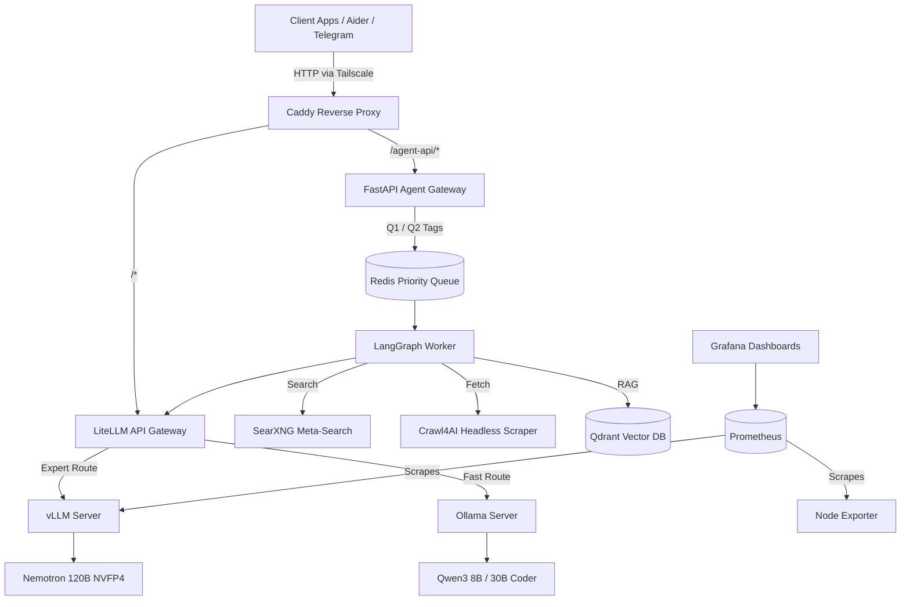

# Spark AI Platform

A self-hosted, event-driven AI platform built on an NVIDIA DGX Spark (128GB Unified Memory, Grace Blackwell GB10). 

This project provides a production-grade, 24/7 private OpenAI-compatible API featuring a dual-loop LangGraph agent, adversarial verification, web grounding, and priority queuing.

## Quickstart (Run in 3 Commands)

Ensure Docker and Tailscale are installed, then run:

    git clone [https://github.com/yourusername/spark-ai-platform.git](https://github.com/yourusername/spark-ai-platform.git)
    cd spark-ai-platform
    cp .env.example .env && nano .env
    docker compose --env-file .env -f compose/llm.yml -f compose/agents.yml -f compose/observability.yml up -d

## Architecture

## Architectural Choices (The "Why")

### Memory Management & NVFP4 (Compute)

With 128GB of unified memory shared across the OS and GPU, running a 120B frontier-class model natively is a tight fit. I utilized vLLM capped at 72% memory utilization (`--gpu-memory-utilization 0.72`) and leveraged Blackwell's native NVFP4 quantization. This allows `Nemotron-3-Super-120B` to remain entirely in memory without triggering the Linux OOM-killer.

### Event-Driven Queuing (Redis)

Because the GPU is a single bottleneck, concurrent requests cause queue thrashing. I implemented an Eisenhower Matrix routing system backed by Redis. Interactive API requests (Q1) bypass the queue, while deep-research tasks (Q2) run in the background via a worker, ensuring the platform remains responsive 24/7 without dropping requests.

### Dual-Loop LangGraph (Agentic Orchestration)

Traditional ReAct loops often suffer from infinite search loops or hallucinations. I built an Actor-Critic architecture. The Actor (120B) dynamically browses the web using Playwright and drafts responses. The Critic (8B) acts as an adversarial verifier, checking the draft against retrieved context and rejecting ungrounded claims before they reach the user.

### Observability (Prometheus & Grafana)

Operating at the edge of hardware memory limits requires strict monitoring. I deployed Prometheus and Node Exporter to scrape system metrics and vLLM token throughput, visualized via Grafana, enabling data-driven optimizations of the `--max-model-len` and batch sizes.

## Deviations from the Base Plan

### Manual Swapping vs. Automated llama-swap

Initial plans to use automated model swapping failed due to container auth issues and context-switching latency. I pivoted to manual bash-based memory evictions, maintaining the 120B model as the primary resident and loading the 30B Coder model strictly on-demand.

### Actor-Critic over Rigid CRAG

The initial plan called for a rigid Corrective RAG pipeline. Testing showed it was too brittle for complex financial queries. I pivoted to a State-of-the-Art Dual-Loop architecture where an 8B model actively grades and audits the 120B model's reasoning.

### HTTP over HTTPS Internally

Attempting to force internal TLS certs on Tailscale IPs caused Caddy routing failures. Since Tailscale inherently acts as an encrypted WireGuard mesh VPN, internal Docker routing was reverted to HTTP port 80, maintaining security without the overhead.
